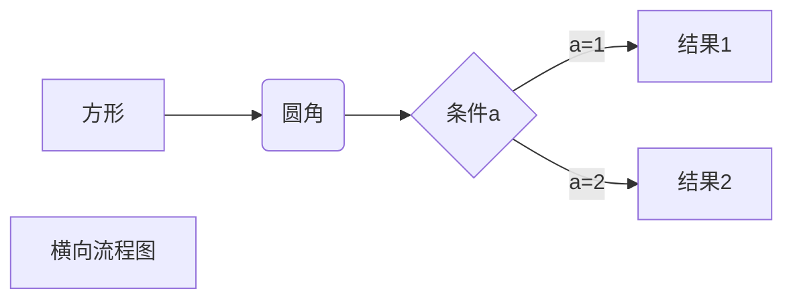

# Chapter 1


{{#playground ../main.rs}}


写的东西:
- [ ] 扫雷  bilibili链接  
- [ ] 数独  我的尝试. 真实的数量. 
- [ ] 




### 如何判断堆中的一个节点有没有孩子？

只需要判断这个节点有没有左孩子。因为堆是完全二叉树，完全二叉树不存在先有右孩子而后有左孩子的情况。


## 图 graph


- 节点 Vertex
- 边 Edge

- 交通运输 点：地方 边：道路
- 社交网络 点：用户 边：认识的关系 


按照有没有方向：
- 无向图 Undirected Graph 
- 无向图 Directed Graph 
    - 无向图是特殊的有向图，没有方向可以看做是双向的 

按照 边 有没有 权重：
- 无权图 Unweighted Graph 边上没有权重 
- 有权图 Weighted Graph 边上有权重


#### 图的连通性 
一个图可以是几个不连通的图的组合

#### 简单图 Simple Graph 
- 自环边 self-loop 
- 平行边 parallel-edges


简单图是**自环边**、**平行边**的图  


### 图的表示 

邻接矩阵 Adjacency Matrix 

Mij==1 表示 节点i和节点j相连 
无向图中，邻接矩阵是沿着对角线对称的。


邻接表  每一行是一个链表 空间消耗比较小
```
0 	1 
1 	0 2 3 
2 	1 3 
3 	1 2 
```


邻接表 适合表示 稀疏图Sparse Graph
邻接矩阵 适合表示 稠密图Dense Graph 

有的图虽然节点繁多，但是每个节点只和几个点相连，那么它是稀疏图。
完全图： 每个点 连接了 除它所有的点


### 图的表示

- 邻接矩阵  adjacency matrix 用二维矩阵表示连通关系
```

```

- 邻接表 adjacency lists 
```
0   1 2 3
1   2 
2   3 
3   1
```

稀疏的图： 一个结点发出的边远少于结点个数。  
稠密图： 比如完全图  
邻接表适合稀疏的图sparse graph。邻接矩阵

### 深度优先遍历 

复杂度 
- 稀疏图 $O(v+w)$
- 稠密图 $O(v^{2})$


### 广度优先遍历

广度优先遍历可以求无权图最短路径

复杂度 
- 稀疏图 Ov+w
- 稠密图 O v^2


blood fill  PS 抠图  


### 生成树


图的遍历结果 可以 生成一棵树


### 最小生成树 

具有一个联通分量的带权无向图，有v个节点，那么，它的最小生成树有v-1条边。
可以退化的，有一些图的树是v-1叉的，所以，有v个节点，那么，它的最小生成树有v-1条边。

在布设电缆、电路等场景可以节约成本。


### 切分定理


`给定任意切分，横切边中权值最小的边必然是最小生成树的边。`


### Prim 算法

从某一节点开始切分，使用切分定理，每次在候选的横切边中能找出一条最小生成树的边。


## 二分搜索树


查找、插入、删除的复杂度都是$O(log(n))$


二分搜索树是这样的一颗二叉树：
- 每个结点的值 大于 左子树的所有结点的值
- 每个结点的值 小雨 柚子树的所有结点的值 

二分搜索树的任意一颗子树也都是满足二分搜索树条件的。


由于条件中有“大于”、“小于“，所以数据类型是支持互相比较的。


#### 后序遍历的用处
在析构函数中，可以用后序遍历来删除二叉搜索树。自己的左孩子、右孩子都销毁了就可以销毁自己了。


#### 层序遍历


#### 中序遍历 

二分搜索树的中序遍历 是一个有序的序列 


#### 删除结点 


- 找出二分搜索树的最大值、最小值  往最左走、往最右走
- 删除最小值、最大值。 如果最小值有右子树，右子树可以直接前往最小值的位置，**二分搜索树依然满足性质**。
- 我们发现，只有一个孩子的结点也可以使用直接顶替的办法，依然满足二分搜索树的性质。


对有左子树且有右子树的结点，可以使用Hibbard提出的删除方法（1962） 可以用前驱结点顶替，也可以用后继结点顶替。


#### 二分搜索树的顺序性

- 最大值、最小值
- 某结点的 前驱 后继 要求这个结点存在
- 某结点的 floor ceil 不要求结点存在这个
- 求rank 做法：结点中保存一个成员变量，保存这个子树包含的结点数目

#### 二分搜索树的局限
- 同样的数据，树的形状可能不一样。
- 最差情况： 二分搜索树退化成了一个链表。 比如按顺序输入`[1,2,3,4,5,6]`,那么得到的树是

- 解决办法： 
    - 如果能一下子得到所有数据，将它们打乱，再插入到二分搜索树中。
    - 平衡二叉树 红黑树 2-3 AVL Splay
    -  ... 

- 平衡二叉树、堆： Treap
- trie 像翻字典一样


# 算法 


## 查找 find

查找是一个听起来朴素实际上困难的问题。

### 二分查找法  Binary Search

在有序的数列中使用二分查找。

二分查找法在1946年提出，但是1962年才出现了第一个没有bug的二分查找法。
这是因为`(l+r)/2`可能会导致越界，写成`l+(r-l)/2`就不会越界了.


`[............floor...ceil..................]` 


#### 能高效地解决查找问题 


查找 听起来朴素 实际上困难。

#### 二分查找法  Binary Search

只能在有序的数列中使用二分查找。

二分查找法在1946年提出，但是1962年才出现了第一个没有bug的二分查找法。
这是因为`(l+r)/2`可能会导致越界，写成`l+(r-l)/2`就不会越界了.


`[............floor...ceil..................]`   


### 关于形参和实参


parameters是定义函数的时候写下的；它规定了函数的调用者应该按照什么样的形式向函数传入参数。

arguments是使用函数的时候按照parameters的样子对应写下的。


```
#### 介绍
我需要重新学习数据结构。顺便把常用的数据结构记下来。
这个笔记是由以下课程组成的：
- 波波老师
- [丁老师](http://dsa.cs.tsinghua.edu.cn/~deng/ds/) [课件](https://dsa.cs.tsinghua.edu.cn/~deng/ds/dsacpp/)
- 波波老师
  


#### 目录

# dataStuctureForXQ


.
├── 01-序言
│   ├── 01-序言.html
│   ├── 01-序言.md
│   ├── 02-复杂度.md
│   ├── 计算机模型.md
│   ├── 时间.md
│   └── code
│       ├── hailstone
│       └── hailstone.cpp
├── 02-链表
├── 03-树
├── 04-图
├── 05-树
│   └── note.md
├── 55-排序
│   ├── 插入排序.md
│   ├── 动画图解.md
│   ├── 交换元素.md
│   ├── 快速排序.md
│   ├── 选择排序.md
│   └── nlogn.md
├── Heap
│   └── heap.md
├── README.en.md
└── README.md

#### 使用说明
- 可以直接查看章节的PDF版本
- 如果使用Markdown查看，VS code中需要安装公式公式插件`Markdown All in One`。
  
#### 参与贡献

1.  Fork 本仓库
2.  新建 Feat_xxx 分支
3.  提交代码
4.  新建 Pull Request


lx@PE 2021 dataStuctureAndAlgorithm % tree .
.
├── README.md
├── todo.md
├── 图
│   └── 图论.md
├── 排序
│   ├── insertSort.cpp
│   ├── selectionSort.cpp
│   ├── 交换元素.md
│   ├── 动画图解.md
│   ├── 快速排序.md
│   ├── 插入排序.md
│   └── 选择排序.md
├── 查找
│   ├── 二分搜索.md
│   └── 二分搜索树.md
├── 绪论
│   ├── 绪论.md
│   └── 是不是算法-hailstone.cpp
├── 链表
│   └── 链表.md
├── 二叉树
│   ├── heap.md
│   ├── 树.md
│   ├── 优势.md
│   ├── 二叉树.md
│   └── 线段树.md
├── 哈夫曼.md
├── 并查集.md
├── 递归思想
│   ├── 递归-hanoi.c
│   ├── 递归-汉诺塔.go
│   └── 递归.md
├── 动态规划思想
│   └── 动态规划.md
├── 关于形参和实参.md
└── 数组、向量、栈、队列
    ├── 栈.md
    ├── 向量.cpp
    ├── 向量.md
    ├── 数组.md
    └── 队列.md

10 directories, 32 files


```


|            | 问题                | 首次学习 | 趁热乎写 | 复习      | C++ | Java | Python | Golang |
| ---------- | ------------------- | -------- | -------- | --------- | --- | ---- | ------ | ------ |
| 选择排序   |                     | 2017     | 2019     | 2020 2022 | y   | y    | y      | y      |
| 插入排序   |                     | 2017     | 2019     | 2022 2020 | Y   | Y    | Y      | Y      |
| 快速排序   | 二路 三路           | 2019     | 2019     | 2022      | y   | Y    | y      | y      |
| 归并排序   |                     | 2019     | 2019     | 2022      | y   | Y    | y      | y      |
| 堆         | shift up shift down | 2019     | 2019     | 2022      | y   | Y    | y      | y      |
| 二分法     |                     | 2019     | 2019     | 2022      | y   | Y    | y      | y      |
| 二分搜索树 |                     | 2019     | 2019     | 2022      | y   | Y    | y      | y      |
| 线段树     |                     | 2021     |          |           |     |      |        |        |
| 链表       |                     | 2021     |          |           |     |      |        |        |
| 队列       |                     | 2021     |          |           |     |      |        |        |
| 栈         |                     | 2021     |          |           |     |      |        |        |
|            |                     | 2021     |          |           |     |      |        |        |
| 线段树     |                     | 2021     |          |           |     |      |        |        |
| 线段树     |                     | 2021     |          |           |     |      |        |        |


## 贪心.
贪心选择性质. 
反证法. 数学归纳法.


### KMP