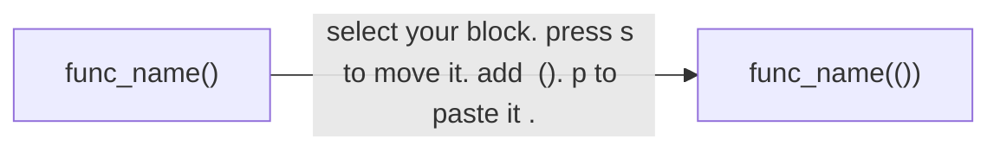

# vim


### 大小写的用途:
```
# Define constants for the screen width and height
SCREEN_WIDTH = 300
```
为了舒服:


### 如何快速再包一层括号?
screen = pygame.display.set_mode(SCREEN_WIDTH, SCREEN_HEIGHT)
```
GPT:
移动光标到需要包裹的代码行。
进入可视模式：按 v 或 V（行选择模式）。
选择需要包裹的代码。
按 S（大写 S）：这会删除选中的文本并进入插入模式。
输入左括号 (，然后按 Esc。
按 p：这会将之前删除的文本粘贴回来。
输入右括号 )。
```
所以可以这样:


### 发现缺少头文件, 添加了之后如何快速回到原来的位置?
`"``"`
连按2下反引号. 


### 希望把内容移动到中间
`zz`


```

只要使用服务器，就需要用到vim
使用纯键盘编辑 可以提高效率  可以限定在字母区域内。

靠肌肉记忆  插件

为什么vim有很多模式：大部分时间是为了看。


a/i/o 插入模式

C^h 删除上一个字符

:set nu 设置行号

在终端下 C^a C^e C^b C^f 
快速到Nomal模式 C^c C^[ Esc
快速回到上次编辑的位置 gi

关于键盘选择：HHKB  Poker2
修改键位 大写键不经常用到

HJKL 移动

w 下一个word开头
e 下一个word结尾
b  上一个word开头    Word 与 word 空白符分隔的单词


跨行的移动 
f{char}   t{char} 
;, 

0 第一个字符
^ 第一个非空白字符
￥ 移动到行尾

gg 文章开头
G 文件结尾

C^o返回

H　屏幕开头
Ｍ　screen中间
Ｌ屏幕结尾
C^u C^f上下翻页
ｚｚ　把屏幕放到中间

增删改查
x 删除一个字符
ｄ　删除一个单词
搭配数字　
ｄａｗ
ｄｉｗ
ｄｗ

ｄｄ　删除一行
ｄｔ）删除双引号
ｄ０
ｄ￥


修改
ｒ　ｒｅｐｌａｃｅ                   R 相当于平时的Ｉｎｓ键
ｃ　ｃｈａｎｇｅ                        
ｓ　ｓｕｂｓｔｉｔｕｔｅ                S 整行删除进入插入模式


查询
/ ? 前向、反向搜索

n/N 跳转到下一个匹配　　　* #


搜索替换
批量修改变量名
substitute :[range]s[ubstitute]/{pattern}/{string}/[flags]
% 表示全部
g global
c confirm 确认
n number 报告次数　不进行替换


```


